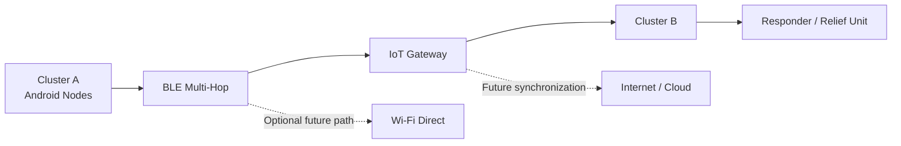

# ResQNet — Node-to-Node Offline Communication for Disaster Areas

<p align="center">
  <strong>An offline communication system for disaster and infrastructure-constrained environments</strong>
</p>

<p align="center">
  <em>Enabling nearby devices to discover, exchange, relay, and store messages without relying on cellular networks or the Internet.</em>
</p>

---

## 📌 Project Overview

**ResQNet** is an MCA research and prototype project that explores **node-to-node offline communication** between Android devices when conventional communication infrastructure is unavailable or unreliable.

The project focuses on a decentralized communication model in which every participating device acts as a **communication node**. A node can originate a message, receive messages from nearby nodes, and relay messages toward other nodes.

The first implementation focuses on a **BLE-based prototype** using advertising and scanning, with the long-term project direction extending toward multi-hop communication, store-and-forward delivery, and optional Wi-Fi Direct / IoT gateway integration.

> **Current implementation priority:** Build and experimentally evaluate the BLE communication core first. Advanced components are added only after the core system is working and measurable.

---

## 🎯 Problem Statement

In disaster areas and infrastructure-constrained environments, cellular networks, Internet connectivity, and local Wi-Fi may become unavailable or unreliable.

In the target scenario, physical environments may also contain concrete structures, metal equipment, tanks, walkways, and dense piping that can further affect wireless coverage.

As a result, a worker or user may need to move closer to another person simply to pass information.

ResQNet investigates an offline, device-to-device alternative where nearby devices can communicate directly and use intermediate devices to extend message delivery beyond a single direct connection.

---

## 💡 Core Idea

The fundamental communication model is:

```text
Node A  →  Node B
```

and, after multi-hop functionality is implemented:

```text
Node A  →  Node B  →  Node C
```

Here, **Node B acts as a relay**.

For temporarily unavailable destinations, the system follows a **store-and-forward** model:

```text
Message created
      ↓
Stored locally
      ↓
Destination unavailable
      ↓
Suitable node becomes reachable
      ↓
Message forwarded
      ↓
Destination receives message
```

The forwarding mechanism is intended to use:

- A unique message ID
- TTL / hop limit
- Duplicate detection
- Local message storage
- Relay / forwarding
- Delivery acknowledgement and status

---

# 🔬 Research Direction

The project is being developed as both a **software prototype** and an **experimental research study**.

The research question is:

> **How effectively can a lightweight BLE-based store-and-forward communication system support multi-hop text message delivery between Android devices without Internet or cellular infrastructure?**

### Initial research hypotheses

**H1:** Increasing the number of relay hops increases end-to-end message latency.

**H2:** Increasing the number of nodes can extend effective communication reach but may also increase forwarding overhead.

**H3:** TTL-based forwarding with duplicate detection can reduce unnecessary message propagation compared with unrestricted repeated forwarding.

These hypotheses will be evaluated through experiments rather than assumed to be true.

---

# 🏗️ Current System Scope

The development is intentionally staged.

### Phase 1 — BLE Communication Core

```text
Android Device A
       ↕
  BLE Discovery
       ↕
Android Device B
```

Goals:

- BLE scanning
- BLE advertising
- Nearby node discovery
- Basic node identification
- Direct message exchange

### Phase 2 — Message Protocol

Introduce a structured message model such as:

```json
{
  "messageId": "MSG001",
  "senderId": "NODE_A",
  "destinationId": "NODE_C",
  "timestamp": 1726500000,
  "ttl": 3,
  "messageType": "TEXT",
  "payload": "Need assistance"
}
```

### Phase 3 — Multi-Hop Relay

```text
A → B → C
```

A message received by B can be forwarded to C when appropriate.

### Phase 4 — Duplicate Detection and TTL

Every node checks whether a message has already been processed.

```text
New message?
   ├── No → Drop
   └── Yes
        ↓
     Store
        ↓
   TTL > 0 ?
     ├── No → Stop
     └── Yes
          ↓
       TTL - 1
          ↓
       Forward
```

### Phase 5 — Store-and-Forward

Messages remain locally stored when the destination is temporarily unreachable and may be forwarded when the required node becomes reachable.

### Phase 6 — Delivery Tracking

Planned states include:

```text
PENDING
SENT
FORWARDED
DELIVERED
FAILED
```

### Phase 7 — Experimental Evaluation

The system will be tested under controlled conditions using multiple devices and different communication scenarios.

---

# 🌐 Long-Term Architecture

The broader project vision includes communication across physically separated clusters.



The **IoT gateway / Wi-Fi Direct components are not prerequisites for the first prototype**. They are later research and engineering extensions after the BLE core has been implemented and evaluated.

---

# 🧩 Technology Stack

## Mobile Application

- **React Native**
- **TypeScript**
- **Android**

## Communication

- **Bluetooth Low Energy (BLE)**
- Android native Bluetooth capabilities where required

## Local Storage

- SQLite / local database

## Development

- Node.js
- npm
- Android Studio
- Android SDK
- Git
- GitHub

## Planned / Future Components

- Wi-Fi Direct
- ESP32-based relay / gateway
- LoRa-based long-range communication
- GPS and offline location sharing
- Offline maps

---

# 📂 Repository Structure

```text
resqnet-offline-communication/
│
├── android/                  # Native Android project
├── ios/                      # React Native iOS project (framework-generated)
│
├── src/                      # Application source code
│   ├── components/           # Reusable UI components
│   ├── screens/              # Application screens
│   ├── services/             # BLE and application services
│   ├── storage/              # Local database / persistence
│   ├── protocol/             # Message protocol and packet handling
│   ├── routing/              # Relay and forwarding logic
│   ├── utils/                # Utility functions
│   └── types/                # TypeScript types
│
├── docs/                     # Project and research documentation
│   ├── problem-statement.md
│   ├── research-question.md
│   ├── requirements.md
│   ├── architecture.md
│   └── research-log.md
│
├── literature/               # Research papers and literature notes
├── experiments/              # Experimental procedures and test plans
├── data/                     # Raw experimental measurements
├── results/                  # Processed results, tables and figures
├── diagrams/                 # System / protocol diagrams
├── paper/                    # Research paper drafts and submission files
│
├── App.tsx
├── package.json
├── tsconfig.json
└── README.md
```

> `node_modules/` is intentionally excluded from version control through `.gitignore`.

---

# 📊 Planned Experimental Evaluation

A major goal of ResQNet is to produce **measurable experimental evidence**, not only a working demonstration.

### Metrics

| Metric | Purpose |
|---|---|
| Delivery Rate | Percentage of messages successfully delivered |
| End-to-End Latency | Time required for a message to reach the destination |
| Hop Count | Number of forwarding nodes used |
| Packet / Message Loss | Messages not successfully delivered |
| Duplicate Forwarding | Repeated forwarding of already-seen messages |
| Discovery Time | Time required to detect a nearby node |
| Effective Range | Practical communication distance under test conditions |
| Store-and-Forward Delay | Additional delay caused by temporary destination unavailability |
| Energy / Battery Impact | Approximate resource cost of continuous communication |

### Planned test scenarios

```text
Test 1  →  2-device direct communication
Test 2  →  3-device single-relay communication
Test 3  →  5-device multi-node communication
Test 4  →  Different physical distances
Test 5  →  Obstructed environments
Test 6  →  TTL variation
Test 7  →  Duplicate-message scenarios
Test 8  →  Store-and-forward delivery
Test 9  →  Repeated-message reliability testing
```

The exact device count and experimental parameters will be finalized during implementation and pilot testing.

---

# 📋 Development Roadmap

```text
[1] Project Setup
        ↓
[2] BLE Discovery
        ↓
[3] Direct Message Exchange
        ↓
[4] Message Protocol
        ↓
[5] Local Message Storage
        ↓
[6] TTL + Duplicate Detection
        ↓
[7] Multi-Hop Relay
        ↓
[8] Store-and-Forward
        ↓
[9] Acknowledgement / Delivery Status
        ↓
[10] Multi-Device Experiments
        ↓
[11] Performance Analysis
        ↓
[12] Research Paper
        ↓
[13] Submission / Revision
        ↓
[14] MCA Project Demonstration
```

---

# 🧪 Research Workflow

The project will maintain a separation between **implementation**, **experimentation**, and **research documentation**.

```text
Literature
    ↓
Research Gap
    ↓
System Design
    ↓
Prototype
    ↓
Experiment
    ↓
Raw Data
    ↓
Analysis
    ↓
Findings
    ↓
Research Paper
```

Every major development or experiment should be recorded in:

```text
docs/research-log.md
```

A research-log entry should contain:

```text
Date
Objective
Implementation / Experiment
What worked
What failed
Observed result
Changes made
Next task
```

---

# 👥 Project Team

### Students

**Nayan Jyoti Athporia**  
MCA/25/017

**Nirmal Jyoti Thakuria**  
MCA/25/018

**Pranaydeep Sarkar**  
MCA/25/26

### Project Guide

**Dr. Nelson Varte**

### Department

**Department of Computer Applications**  
**Assam Engineering College**

### Academic Session

**2025–2027**

---

# 📚 Literature Base

The project literature review covers several related areas:

- Bluetooth Low Energy and BLE flooding
- Bluetooth Mesh
- Offline / emergency communication
- Peer-to-peer mobile communication
- Wi-Fi Direct
- Multi-hop routing
- Wi-Fi Direct group management
- IoT-assisted relay communication
- Communication power and security considerations

Important references currently considered for the project include work on SafeHaven-FOSS, Bluemergency, Bluetooth/Wi-Fi Direct P2P communication, Wi-Fi Direct networking, multi-hop Wi-Fi Direct, and BLE flooding / mesh approaches.

The literature review is used to identify the research gap and guide the design of the prototype rather than to assume that the proposed system is already validated.

---

# 🚀 Getting Started

## Prerequisites

Install:

- Node.js
- npm
- Java Development Kit
- Android Studio
- Android SDK
- Android Platform Tools
- A physical Android device or Android emulator

## Clone the Repository

```bash
git clone https://github.com/NirmalJT/resqnet-offline-communication.git
cd resqnet-offline-communication
```

## Install Dependencies

```bash
npm install
```

## Start Metro

```bash
npm start
```

## Run Android

Open another terminal in the project root:

```bash
npm run android
```

For BLE development, a **physical Android device is preferred** because the project ultimately depends on real Bluetooth hardware and radio behaviour.

---

# 🔐 Offline-First Principle

The fundamental communication path of the core system is designed to operate without:

```text
❌ Cellular network
❌ Internet
❌ Central server
❌ Cloud dependency
```

Instead, communication is based on nearby devices and local storage.

Any future Internet/cloud synchronization is treated as an **optional extension**, not a dependency of the core offline messaging mechanism.

---

# ⚠️ Current Status

**Status: 🚧 Research & Prototype Development**

### Completed

- Project scope definition
- Problem study
- Requirements identification
- Literature survey
- Initial architecture
- BLE-based first-prototype direction
- Initial project setup

### In Progress

- React Native project setup
- BLE communication implementation
- Two-device discovery

### Planned

- Direct messaging
- Message protocol
- TTL
- Duplicate detection
- Multi-hop relay
- Store-and-forward
- Delivery acknowledgement
- Multi-device testing
- Experimental analysis
- Research paper preparation

---

# 📖 Project Documentation

Research and development documentation is maintained inside the repository.

Key files will include:

```text
docs/
├── problem-statement.md
├── research-question.md
├── requirements.md
├── architecture.md
└── research-log.md
```

Experimental material:

```text
experiments/
data/
results/
```

Research-paper material:

```text
paper/
```

---

# 🤝 Contribution

This repository is primarily an academic research and MCA project repository.

Development contributions from the project team should follow the documented architecture, research objectives, and experimental methodology.

For significant changes, document:

1. What changed
2. Why it changed
3. What was tested
4. Experimental impact, when applicable

---

# 📄 Research & Publication

The project is intended to progress from:

**Prototype → Experimental Evaluation → Research Paper → Submission**

The research paper will be based on **actual implementation and experimental results** obtained from the system.

No performance claim should be added to the paper or README unless it is supported by recorded experiments.

---

# 📜 License

License: **To be finalized**

---

<p align="center">
  <strong>ResQNet</strong><br>
  Node-to-Node Offline Communication for Disaster Areas
</p>

<p align="center">
  Assam Engineering College • Department of Computer Applications • 2025–2027
</p>
